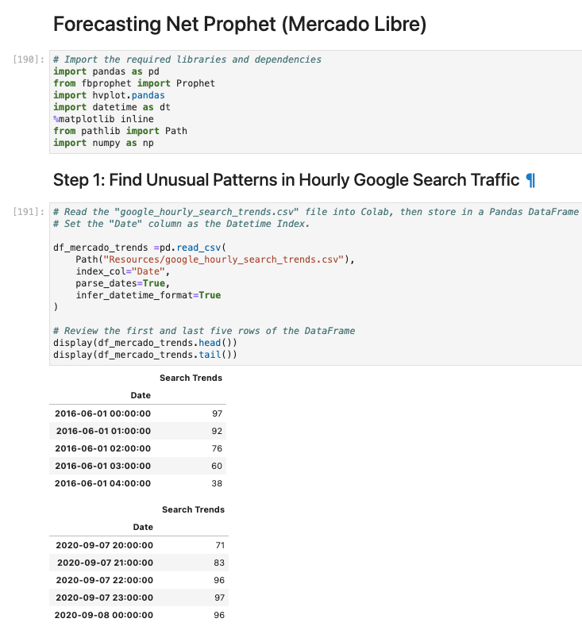
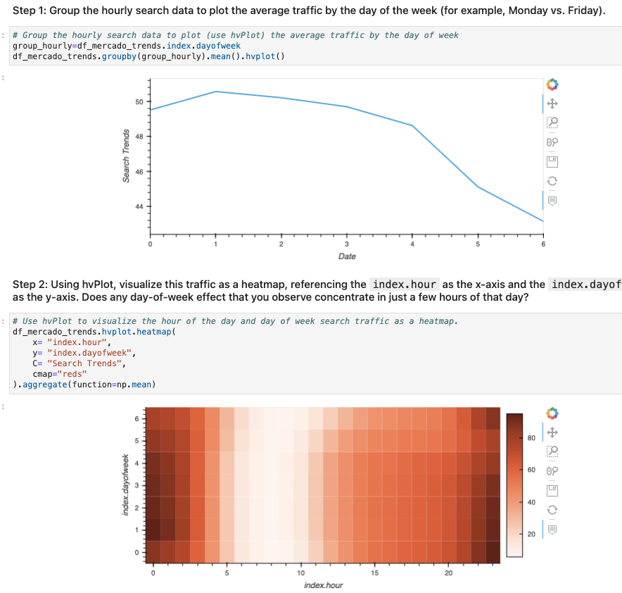
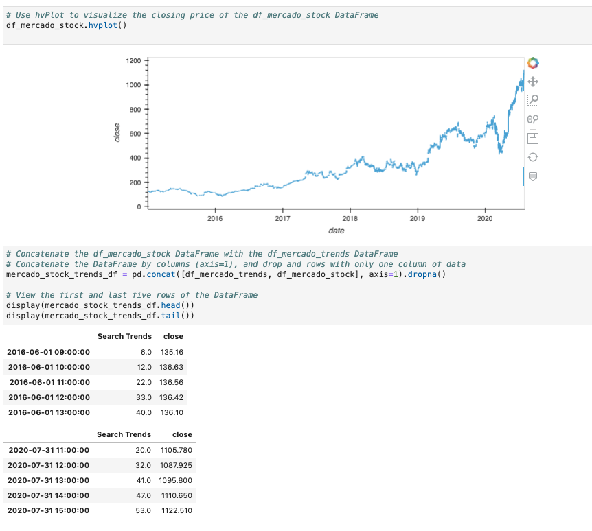
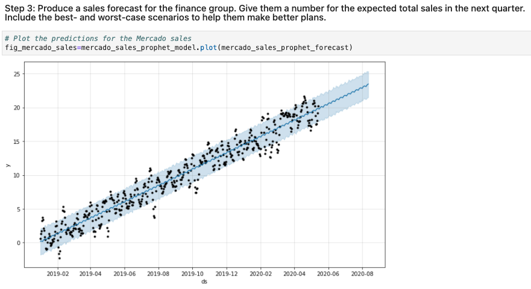

# forecasting_Mercado_Libre

this is a Jupyter notebook with the ability to predict search traffic, can translate into the ability to successfully trade the stock. 
Find unusual patterns in hourly Google search traffic, mine the search traffic data for seasonality, relate the search traffic to stock price patternsand then create a time series model with Prophet to finally  forecast revenue by using time series models

---

## Technologies

This project leverages python 3.7 with the following packages:

* [fbprophet](https://facebook.github.io/prophet/) 
* [hvplot](https://hvplot.holoviz.org/index.html#) 
* [datetime](https://docs.python.org/3/library/datetime.html)
* [pathlib](https://docs.python.org/3/library/pathlib.html)
* [pandas](https://pandas.pydata.org/docs/index.html)
* [matplotlib](https://matplotlib.org/)
* [numpy](https://numpy.org/)

---

## Installation Guide

Before running the application first install the following dependencies.

```python
  pip install pandas 
  pip install hvplot
  
```
  Here some info about how to install fbprophet
  * [fbprophet installation](https://stackoverflow.com/questions/56701359/running-setup-py-install-for-fbprophet-error)


---

## Usage

Upon launching the  application you will be greeted with the following prompts.






 -->

---


## Contributors

Israel Fernandez

---
